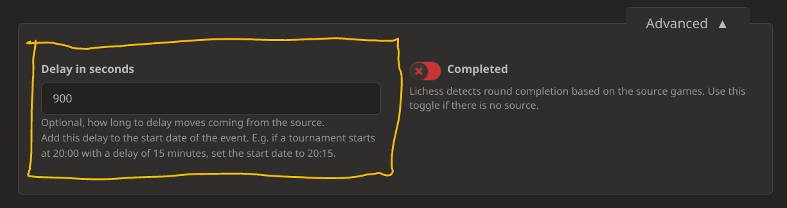
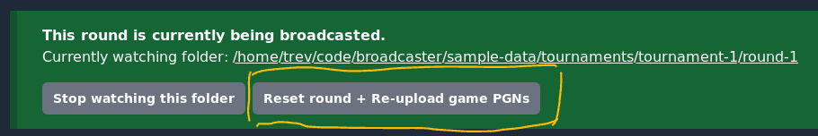
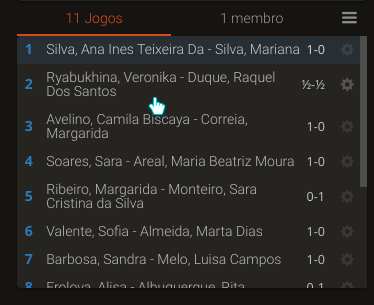

## I need help, how can I ask for help?
You can ask for help on [our Discord](https://discord.gg/lichess) or by emailing [broadcast@lichess.org](mailto:broadcast@lichess.org)

## Can I set delay?
Yes, you can adjust the delay in a Broadcast by adjusting the round settings.

(An example on a 900 second (15 minute) delay)

## I need a private viewing without delay, what do I do?
You can leave it without delay and ask our Broadcast Team to create a new Broadcast with delay.

## What is the advantage of using the APP instead of using something else?
You won't have to rely on setting up a server to host your events or third-party services that don't want to be used as sources for other platforms. Furthermore, you will have easier access by delaying your event and movements will be more in real time.

## Lichess shows disorganized boards
Sometimes it can happen that the boards are disorganized or the upload system first sends an order that is not the one intended.

Therefore, in the Application there is a “Reset” button that clicking will delete all boards already placed and will upload the `games.pgn` file (if available) for reordering.

In some cases, you can reorder directly through Lichess, not as would be done in studies.

